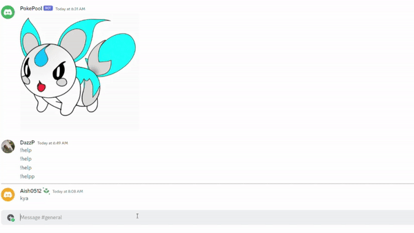
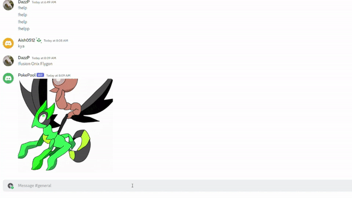

# Code Olympics 2023 JP Morgan Challenges & Solutions (Team 25)

A 24-hour event for teams to solve bite-sized coding challenges set by GUTS and Industry Experts!

## APIs, yo!

**Task:** Combine 2 or more APIs to produce something cool.

### Solution

**Pokemon Fusion:** The Pokemon Fusion is a fun project that combined the Pokemon API, OpenAI, DALL-E API, and Discord API to allow users to fuse two Pokemon and generate a unique image of the fusion. The project is built using Python and is designed to run as a Discord bot.

**Technologies Used**

- **Python:** Programming Language used to write the bot and connect to the various APIs.
- **Discord API:** API used to connect the bot to Discord and enable user interaction.
- **Pokemon API:** API used to fetch data about Pokemon and their characteristics.
- **OpenAI API:** API used to generate text prompts for the DALL-E API.
- **DALL-E API:** API used to generate union images based on text prompts.

**Project Overview**

The Pokemon Fusion Project allows users to enter the names of two Pokemon using a Discord command. The bot then uses the Pokemon API to retreive information about the two Pokemon, such as their type, color, and features. The bot then sends this information to the OpenAI API, which generates a text prompt based on the chracteristics of the two Pokemon. 

The bot then sends the prompt to the DALL-E API, which generates a unique image of a fusion between the two Pokemon. The image is then sent back to the user on Discord, allowing them to see the result of the fusion.

**Demonstration**

Example 1: "!fusion Onix Flygon"

Example 2: "!fusion Squirtle Pikachu"

**Conclusion**

It is a fun and an educational project that demonstrates how different APIs can be used together to create unique and interesting applications. 

This project could be expanded in the future to include additional features, such as user accounts, leaderboards, edit the background and more.
