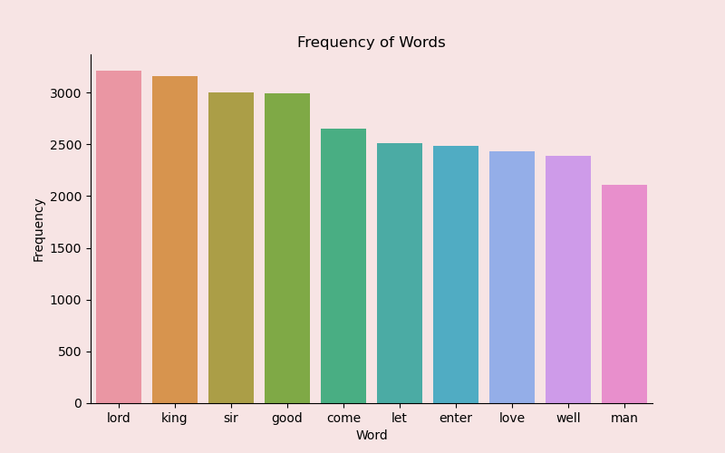
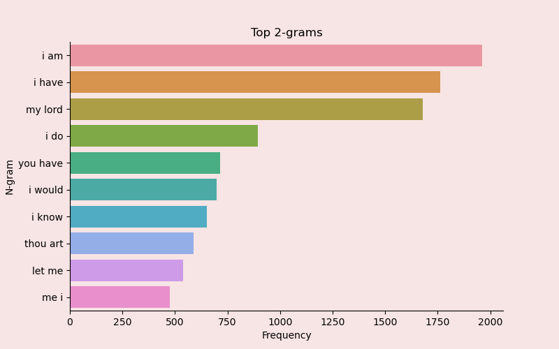
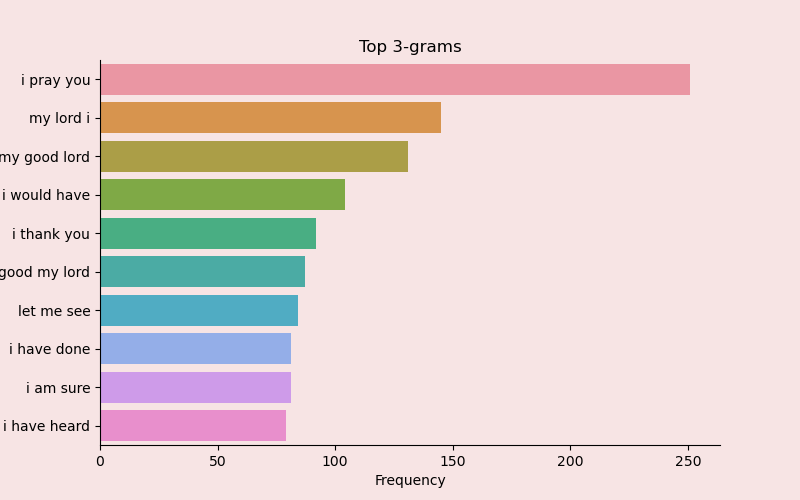
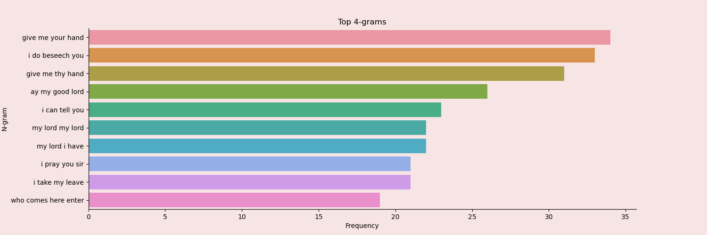
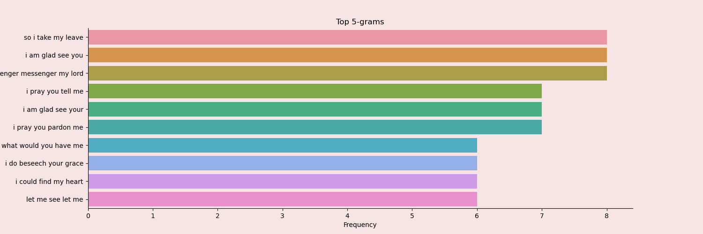

# Morgan Stanley Challenges (Team 25)

## Guess My Password

**Task:** A common security method used for online banking is to ask the user for three random characters from a passcode. For example, if the passcode was 531278, they may ask for the 2nd, 3rd, and 5th characters; the expected reply would be: 317. The attached text file, keylog.txt, contains fifty successful login attempts. Given that the three characters are always asked for in order, analyse the file so as to determine the shortest possible secret passcode of unknown length.

**Solution**

Password: 73162890

## Shakespeare Analysis Part 1

**Task:** List the top 100 most frequent words and their frequencies in the complete works of Shakespeare:

https://www.gutenberg.org/cache/epub/100/pg100.txt

**Solution**

## Shakespeare Analysis Part 2

**Task:** List the top 10 n-grams of length 2, 3, 4 and 5.

**Solution**

## Shakespeare Analsis Part 3

**Task:** Visualise the Shakespeare texts in the most interesting way.

## Network PCAP Analysis

**Task:** This challenge is an exercise in basic network protocol analysis. The aim is to analyse the .PCAP file and find the data hidden within it. To complete the challenge simply find the names of 11 countries being transferred across the network and tell us which protocol they were hidden in. Some are much easier than others.

**Solution**

|   Country Name   |   Network Protocol   |
|       ---        |         ---          |
|       USA        | HTTP (Image file)    |
|      Italy       | SMB2 (MP3 file)      |
|     Bulgaria     | MDNS                 |
|     Romania      | DNS                  |
|     Zambia       | SMB2                 |
|     Brazil       | SMB2                 |
|     Wales        | FTP                  |
|     France       | FTP                  |
|    Scotland      | MDNS                 |
